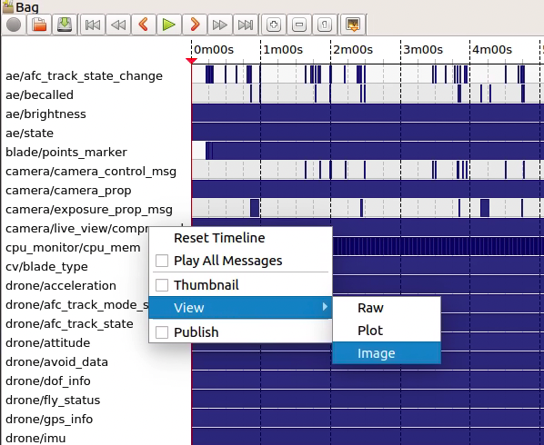

# 针对一个具体的issue，首先定位问题所在：
IRIS中国：https://iris-as.clobotics.cn/#/login \
IRIS外国：https://iris-eu.clobotics.com/#/login \

通过IRIS以及issue提供的“风场名”、“风机号”、“巡检id”等信息，定位到日志，在日志中下载相应的bag文件。 

如果issue里并未提供具体的bag名，那么需要将日志下的所有以data_big为前缀的bag下载下来观看

bag文件的访问方式： \
在安装好ros环境的机器上，终端运行roscore，然后右键bag文件，以rqtbag打开。 \
右击camera/live_view/compressed,选择view/image
 \
然后右击cv/blade_type，选择view/plot，即可将巡检帧图和预测分数可视化

# 定位好问题后，从bag文件中提取相应图片
python extract_img.py